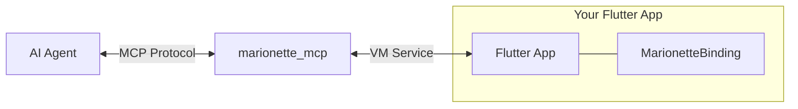
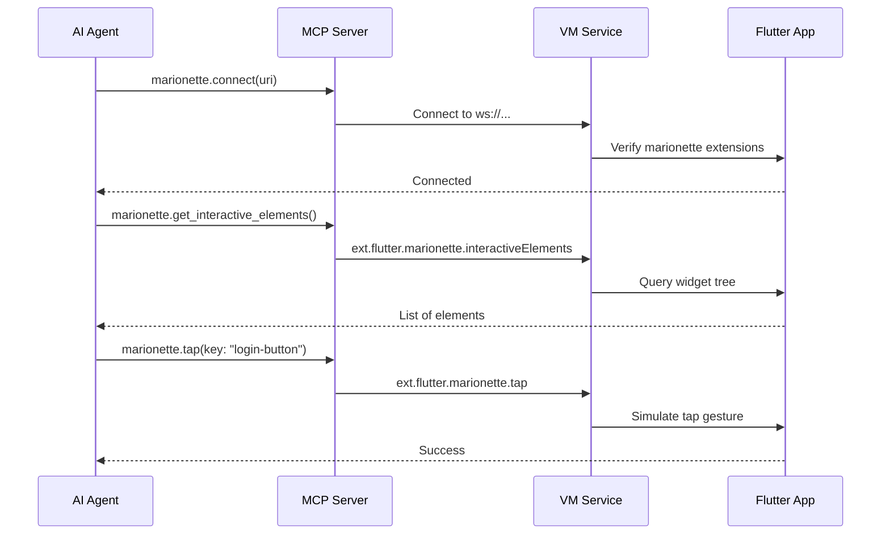

# Marionette MCP


**"Playwright MCP, but for Flutter apps"**

Marionette MCP enables AI agents (like Cursor, Claude Code, etc.) to inspect and interact with running Flutter applications. It provides a bridge between the MCP protocol and the Flutter VM service, allowing agents to see the widget tree, tap elements, enter text, scroll, and capture screenshots for automated smoke testing and interaction.



## Quick Start

**Note: Your Flutter app must be prepared to be compatible with this MCP.**

1.  **Prepare your Flutter app** - Add the `marionette_flutter` package and initialize `MarionetteBinding` in your `main.dart`.
2.  **Install the MCP server** - Add `marionette_mcp` to your projects `dev_dependencies`.
3.  **Configure your AI tool** - Add the MCP server command (`dart run marionette_mcp`) to your tool's configuration (Cursor, Claude, etc.).
4.  **Run your app in debug mode** - Look for the VM service URI in the console (e.g., `ws://127.0.0.1:12345/ws`).
5.  **Connect and interact** - Ask the AI agent to connect to your app using the URI and start interacting.

## Installation

### 1. Add MCP Server Package

Run the following command in your Flutter app directory:

```bash
dart pub add dev:marionette_mcp
```

### 2. Add Flutter Package

Run the following command in your Flutter app directory:

```bash
flutter pub add marionette_flutter
```

## Flutter App Integration

You need to initialize the `MarionetteBinding` in your app. This binding registers the necessary VM service extensions that the MCP server communicates with.

### Basic Setup

If your app uses standard Flutter widgets (like `ElevatedButton`, `TextField`, `Text`, etc.), the default configuration works out of the box.

```dart
import 'package:flutter/foundation.dart';
import 'package:flutter/material.dart';
import 'package:marionette_flutter/marionette_flutter.dart';

void main() {
  // Initialize Marionette only in debug mode
  if (kDebugMode) {
    MarionetteBinding.ensureInitialized(const MarionetteConfiguration());
  } else {
    WidgetsFlutterBinding.ensureInitialized();
  }
  
  runApp(const MyApp());
}
```

### Custom Design System

If you use custom widgets in your design system, you can configure Marionette to recognize them as interactive elements or extract text from them.

```dart
import 'package:flutter/foundation.dart';
import 'package:flutter/material.dart';
import 'package:marionette_flutter/marionette_flutter.dart';
import 'package:my_app/design_system/buttons.dart';
import 'package:my_app/design_system/inputs.dart';

void main() {
  if (kDebugMode) {
    MarionetteBinding.ensureInitialized(
      MarionetteConfiguration(
        // Identify your custom interactive widgets
        isInteractiveWidget: (type) => 
            type == MyPrimaryButton || 
            type == MyTextField ||
            type == MyCheckbox,
            
        // Extract text from your custom widgets
        extractText: (widget) {
          if (widget is MyText) return widget.data;
          if (widget is MyTextField) return widget.controller?.text;
          return null;
        },
      ),
    );
  } else {
    WidgetsFlutterBinding.ensureInitialized();
  }
  
  runApp(const MyApp());
}
```

## Tool Configuration

Add the MCP server to your AI coding assistant's configuration.

### Cursor

[](https://cursor.com/en-US/install-mcp?name=marionette&config=eyJjb21tYW5kIjoiZGFydCBydW4gbWFyaW9uZXR0ZV9tY3AifQ%3D%3D)

Or manually add to your project's `.cursor/mcp.json` or your global `~/.cursor/mcp.json`:

```json
{
  "mcpServers": {
    "marionette": {
      "command": "dart",
      "args": ["run", "marionette_mcp"]
    }
  }
}
```

### Google Antigravity

Open the MCP store, click “Manage MCP Servers”, then “View raw config” and add to the opened `mcp_config.json`:

```json
{
  "mcpServers": {
    "marionette": {
      "command": "dart",
      "args": ["run", "marionette_mcp"]
    }
  }
}
```

### Gemini CLI

Add to your `~/.gemini/settings.json`:

```json
{
  "mcpServers": {
    "marionette": {
      "command": "dart",
      "args": ["run", "marionette_mcp"]
    }
  }
}
```

### Claude Code

For Claude Code you need to have the MCP server available globally:

```bash
dart pub global activate marionette_mcp
```

Then you can run the following command to add it:

```bash
claude mcp add --transport stdio marionette -- marionette_mcp
```

## Available Tools

Once connected, the AI agent has access to these tools:

| Tool | Description |
|------|-------------|
| `marionette.connect` | Connect to a Flutter app via its VM service URI (e.g., `ws://127.0.0.1:54321/ws`). |
| `marionette.disconnect` | Disconnect from the currently connected app. |
| `marionette.get_interactive_elements` | Returns a list of all interactive UI elements (buttons, inputs, etc.) visible on screen. |
| `marionette.tap` | Taps an element matching a specific key or visible text. |
| `marionette.enter_text` | Enters text into a text field matching a key. |
| `marionette.scroll_to` | Scrolls the view until an element matching a key or text becomes visible. |
| `marionette.get_logs` | Retrieves application logs collected since the last check. |
| `marionette.take_screenshots` | Captures screenshots of all active views and returns them as base64 images. |

## Example Scenarios

Marionette MCP shines when used by coding agents to verify their work or explore the app. Here are some real-world scenarios:

### 1. Verify a New Feature
**Context:** You just asked the agent to implement a "Forgot Password" flow.
**Prompt:**
> "Now that you've implemented the Forgot Password screen, let's verify it. Connect to the app, navigate to the login screen, tap 'Forgot Password', enter a valid email, and submit. Check the logs to ensure the API call was made successfully."

### 2. Post-Refactor Smoke Test
**Context:** You performed a large refactor on the navigation logic.
**Prompt:**
> "I've refactored the routing. Please run a quick smoke test: connect to the app, cycle through all tabs in the bottom navigation bar, and verify that each screen loads without throwing exceptions in the logs."

### 3. Debugging UI Issues
**Context:** Users reported a button is unresponsive on the Settings page.
**Prompt:**
> "Investigate the 'Clear Cache' button on the Settings page. Connect to the app, navigate there, find the button using `get_interactive_elements`, tap it, and analyze the logs to see if an error is occurring or if the tap is being ignored."

## How It Works

1.  **Initialization**: Your Flutter app initializes `MarionetteBinding`, which registers custom VM service extensions (`ext.flutter.marionette.*`).
2.  **Connection**: The MCP server connects to your app's VM Service URL.
3.  **Interaction**: When an AI agent calls a tool (like `marionette.tap`), the MCP server translates this into a call to the corresponding VM service extension in your app.
4.  **Execution**: The Flutter app executes the action (e.g., simulates a tap gesture) and returns the result.



## Troubleshooting

-   **"Not connected to any app"**: Ensure the AI agent has called `marionette.connect` with the valid VM Service URI before using other tools.
-   **Finding the URI**: Run your Flutter app in debug mode (`flutter run`). Look for a line like: `The Flutter DevTools debugger and profiler on iPhone 15 Pro is available at: http://127.0.0.1:9101?uri=ws://127.0.0.1:9101/ws`. Use the `ws://...` part.
-   **Release Mode**: Marionette only works in debug (and profile) mode because it relies on the VM Service. It will not work in release builds.
-   **Elements not found**: Ensure your widgets are visible. If using custom widgets, make sure they are configured in `MarionetteConfiguration`.
